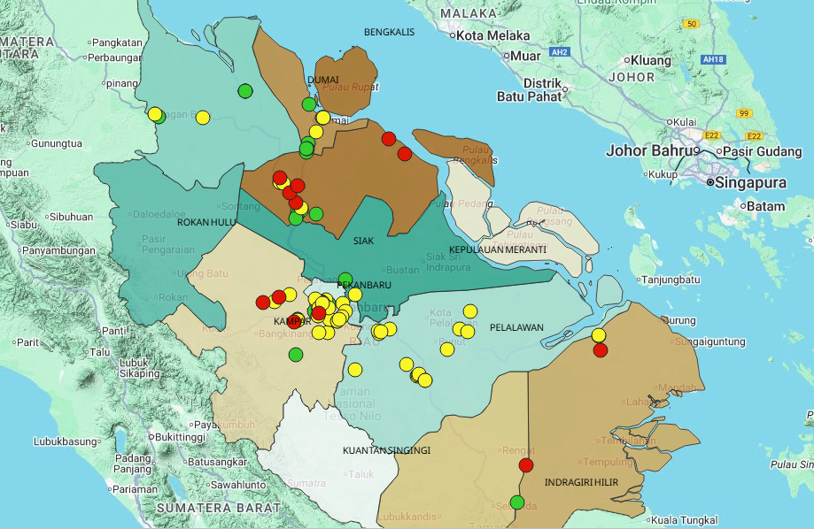

<h1 align="center">🌍 Peta Digital Sumur Air Tanah Provinsi Riau</h1>

  

  <a href="https://salsanasa.github.io/PetaSumurAirTanahRiau/peta/"><strong>🔗 Lihat Peta Interaktif di Sini »</strong></a>

---

### 📖 Deskripsi
Peta digital ini menampilkan sebaran **sumur air tanah di Provinsi Riau**, diklasifikasikan berdasarkan status perizinannya:
- 🟢 **Berizin**
- 🟡 **Izin Kedaluwarsa**
- 🔴 **Tidak Berizin**

Proyek ini dibuat menggunakan **QGIS** dan diekspor ke format web menggunakan **qgis2web (Leaflet)**, lalu dipublikasikan melalui **GitHub Pages**.

---

### 🧭 Tujuan
Mendukung upaya **pengawasan perizinan air tanah** secara efektif, cepat, dan transparan melalui peta digital yang mudah diakses publik.

---

### 🧑‍💻 Pembuat
**Salsa Nazia Putri**  
Penyelidik Bumi Ahli Pertama  
Bidang Geologi dan Air Tanah  
Dinas Energi dan Sumber Daya Mineral Provinsi Riau

---

### ⚙️ Teknologi yang Digunakan
| Komponen | Deskripsi |
|-----------|------------|
| 🗺️ QGIS | Pembuatan peta dan ekspor ke format web |
| 🌿 Leaflet.js | Tampilan interaktif peta |
| 🧩 qgis2web | Plugin untuk konversi otomatis dari QGIS ke web |
| ☁️ GitHub Pages | Hosting peta secara gratis dan publik |

---

  
  
  

---

© 2026 Salsa Nazia Putri

